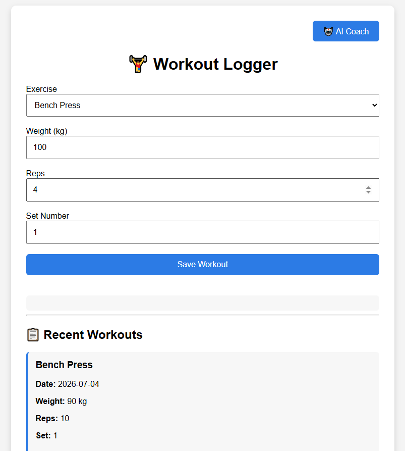
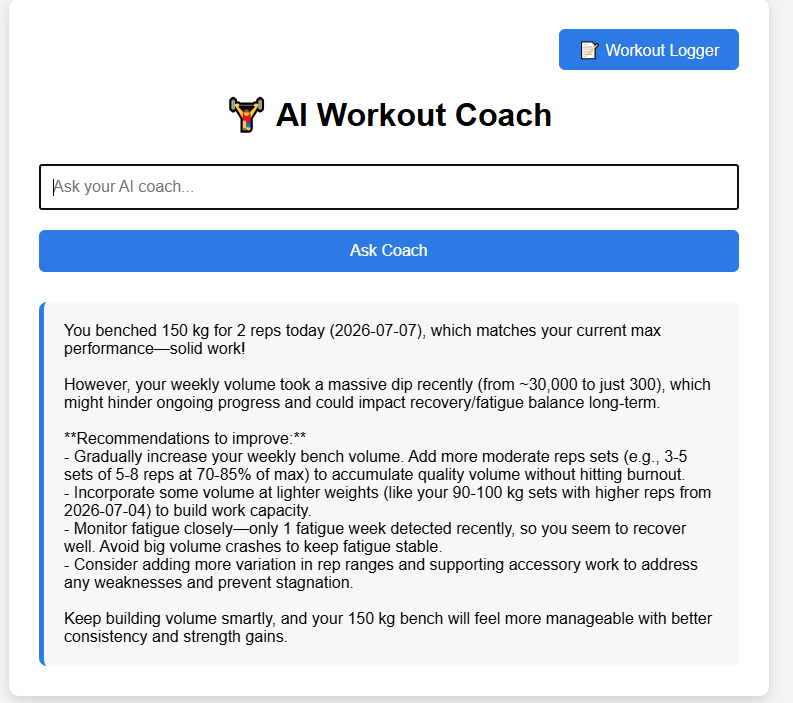

# AI Workout Optimizer

## Overview

AI workout optimiser is a full-stack fitness application that combines workout tracking
data analysis, machine learning, and language models to provide personalised training recommendations

Users can log their workouts through a web interface,store training data in relational database
analyse performance trends, and ask an AI coach questions about their progress. The AI coach uses
engineered workout metrics together with recent workout history to generate contextual coaching
recommendations

The project was bult to demonstrate backend software engineering, database design, machine learning and
AI integration using modern python technologies

## Features
* Log workouts through a web interface
* Store workout data useing a relational SQlite database
* REST API built with FastAPI
* SQLAlchemy ORM for database interaction
* Workout data analysis using Pandas
* Machine learning model to estimate one-rep maximum (1RM)
* Fatigue detecting using rolling performance trends
* AI-powered workout coach using OpenAI API
* Context-aware AI responses using workout summaries and recent workout history
* View recently logged workouts
* Multipage web interface with FastAPI templates

## Tech Stack
### Backend
* Python
* FastAPI
* SQLAlchemy
* pydantic
### Data Analysis & machine learning
* Pandas
* Scikit-learn
### AI
* OpenAI API
### Frontend
* HTML
* CSS
* JavaScript 
* Jinja2 Templates
### Development tools
* Git

## Installation
### Clone the repository:
git clone <repository-url>
### Navigate into the project:
cd AI-workout-optimiser
### Create a virtual environment:
python -m venv .venv
(Activate the virtual environment.)
### Install dependencies:
pip install -r requirements.txt
### Create and seed the database:
python scripts/seed_data.py
### Run the application:
uvicorn app.api:app --reload
### Open your browser:
http://127.0.0.1:8000/coach

## Database design
Application uses a relation database consisting of four main tables:
* Users
* Workouts 
* Exercises
* Sets
Relationships are managed using SQLaclhemyORM
Each workout belongs to a user
Each workout contains one or more sets
Each set references a specific exercise

## ML layer
The application uses a Linear regression model built with Scikit-learn to estimate a users
one rep maximum (1rm) from historical workout data. Workout records are processed using pandas
before training and evaluating the model, with Mean Absolute Error (MAE). The predicted performance
metrics are incorporated into the performance metrics and the AI-generated coaching recommendations.

## AI workout Coach
The AI coach combines engineered workout metrics with workout history to provide personalised recommendations.
The application first analyses workout data using python and pandas before constructing a structured prompt containing:

* Workout summary
* Training volume
* Progress metrics
* Fatigue indicators
* Recent workout history 
* User question

This allows the AI to answer questions about recent workouts and highlighting overall progression while also
providing evidence-based recommendations based on calculated performance metrics.
## Challenges
One of the main challenges during development was providing the AI model with enough context to answer detailed
workout questions. The initial implementaion only supplied high-level workout summaries which limited the capabilities
of the AI. This was improved by combining engineered workout metrics with recent workout history and some prompt engineering
allowing the AI to reason over both calculated metrics and raw training data.

## Future improvements
* User authentication and multiple user support
* PostgreSQL deployment
* Interactive workout charts and visuals
* Analysis for additional exercises
* Smarter retrieval of relevant workout history based on user questions
* Export workout history to CSV or PDF
* 
## Screenshots

## License

This project is licensed under the MIT License